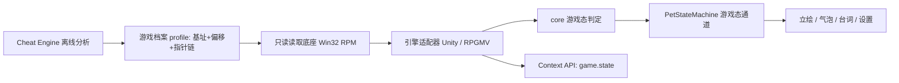

## 需求概述
在 WhalePet 桌宠项目（`f:/develop/desktoppet`）下**新增一份规划文档** `docs/ROADMAP-ex1.md`，规划「桌宠利用 Cheat Engine 分析单机游戏内存、运行期只读感知游戏状态并做陪伴式反馈」的完整实现路径。

本次交付为**纯规划文档**：仅新增该 Markdown 文件，不改动任何源码、`CMakeLists.txt`、测试或构建配置。

## 核心功能（即文档必须承载的内容）
- **整体目标**：桌宠能实时感知游戏状态（血量、金币、等级、坐标等），并给出不打扰的陪伴式反馈。
- **四环节实现链路**：内存数据定位（CE 离线分析）→ 指针链获取（模块基址 + 偏移，处理 ASLR / Unity GC）→ 外部程序只读读取（数据驱动的「游戏档案」）→ 桌宠交互逻辑（立绘 / 台词 / 设置 / 对外 Context）。
- **目标引擎范围**：**主要支持 Unity（Mono 与 IL2CPP 两种后端）与 RPG Maker MV**；其它引擎**仅预留接口**，不作实现要求。
- **阶段划分**：按项目既有风格给出 EX1.0–EX1.5 阶段，每阶段含「阶段目标 / 交付物 / 验收标准 / 不做（范围外）」。
- **关键问题与影响**：以「问题 | 可选选项 | 对方案的影响」表格形式，至少覆盖——目标引擎与是否允许读取、需要哪些具体数据、数据更新频率、桌宠反馈形式、跨平台与反作弊限制。
- **风险与限制**：反作弊 / 封号 / 服务条款 / 法律风险、x64 读取 32 位进程限制、版本漂移导致偏移失效、崩溃处理约定。
- **待确认问题**：汇总上述问题及答案要点。

## 定位与红线（贯穿全文）
- 全程**只读**（不写入、不 patch、不注入、不 hook、不绕过完整性校验）；**仅个人单机 / 离线自用**，**明确禁止**用于联机与对抗性场景。
- 采集默认**关闭**，数据全部本地化，与 P7 感知层「默认关」口径一致。

## 视觉呈现
Markdown 结构化文档：文首引用块（前置阶段 + 依据文档）；「目标 / 技术路径 / 阶段划分 / 风险与限制 / 待确认问题」五节齐备；含阶段总览表、关键问题影响表、验收标准 checkbox，以及一张「内存感知 → 桌宠反馈」数据流图。


## 总体判断
本任务**不落地代码**，唯一产物是 `docs/ROADMAP-ex1.md`。因此「技术栈」指**文档所规划的目标技术栈与拟接入点**，而非本次要引入的依赖。文档须与项目现有分层（`platform` / `core` / `viewmodel` / `contextapi`）严格对齐，使规划可被后续阶段直接执行。

## 技术栈与工具（规划内容，本次不引入）
- **宿主侧（未来实现）**：Qt 6.8.4 + C++17 + MSVC（VS 18 2026），x64，沿用 `whalepet_platform` 感知层；只读 API 用 Win32 `OpenProcess(PROCESS_VM_READ | PROCESS_QUERY_INFORMATION)` / `ReadProcessMemory` / `CreateToolhelp32Snapshot`，仅链接 `kernel32`。依赖口径仍为「零第三方依赖，允许 Qt 官方模块」。
- **分析工具（离线、非运行期依赖）**：**Cheat Engine** 仅用于定位数值、找基址 / 指针链、确认结构体布局；**Il2CppDumper / Cpp2IL** 用于 IL2CPP 从 `GameAssembly.dll` + `global-metadata.dat` 导出 `dump.cs` / `script.json`。
- **Unity 支持**：Mono 后端经 `mono.dll` 导出（`mono_get_root_domain` / `mono_class_get_field_from_name` / `mono_field_get_offset` / `mono_vtable_get_static_field_data`）按类名 / 字段名解析；IL2CPP 后端消费离线导出产物。锁定**静态根**再沿指针链读取，规避 GC 移动。
- **RPG Maker MV 支持**：MV 基于 NW.js（V8 堆有 GC），**不采用经典内存扫描**；主路径为以 `--remote-debugging-port` 启动后经 **Chrome DevTools Protocol（CDP）** 对 `$gameParty` / `$gameVariables.value(n)` / `$gamePlayer.x/y` 做只读 `Runtime.evaluate`；备选为 MV 只读插件 / NW.js 侧桥接；CE 扫描仅作最后回退。

## 实现方案（文档规划的四环节链路）


## 关键技术决策
- **CE 只做离线分析，运行期自读**：避免把 CE 变成运行期依赖，保证产品仍是「双击即用」的独立桌宠。
- **数据驱动 + 失效自检**：偏移不硬编码，转成可替换的「游戏档案（profile）」；每次读取逐跳校验可读性与范围、做纪元 / 版本号复核；失效即优雅降级并提示，而非崩溃。
- **引擎适配器分层**：统一 `IGameStateAdapter` 抽象，Unity / RPGMV 各一个实现；其它引擎只保留接口（满足「仅提供接口」的要求）。
- **RPGMV 走 CDP 而非内存扫描**：复用项目 `docs/ACP-EVAL.md` 中 CDP / 本机回环的既有评估经验，是最稳定的只读路径。
- **可复用既有链路**：`platform` 观察者 → `core::WorkStateRules` 式判据（含置信度 / 滞回）→ `PetStateMachine` 的新通道（参照 P7 的 `EventType::WorkStateChanged`），台词落 `assets/lines/`，设置落 `settings.json_ext`。

## 性能与可靠性
- **更新频率分级**：高频（血量 / 坐标，约 100–200ms）、中频（金币 / 等级，约 0.5–1s）、事件（升级 / 死亡 / 存档，边沿触发）。每次采样只在**开关开启时**进行，关闭即零开销。
- **读取预算**：指针链解析为有界跳数（如 ≤ 4 跳），单次读取限定总字节数；采样在独立线程 / 定时器，避免阻塞 UI。
- **可测性**：以**自建可控内存的测试靶进程（合成目标）**验证读取底座与指针链解析，规避对真实游戏与人工目视的依赖；真实游戏验证列为人工验收项。

## 实施注意（Execution Notes）
- **崩溃红线**：读取越界 / 目标进程异常退出时，遵循 `docs/README.md` §六——**记录现象并交回用户**，AI 不自行调试；文档须显式写入该约定。
- **不越界、不改目标**：全程 `PROCESS_VM_READ`，绝不 `PROCESS_VM_WRITE / VM_OPERATION`；不注入、不 hook、不绕过完整性校验。
- **文档规范对齐**：沿用 `ROADMAP-Pn.md` 的「引用块 + 阶段总览表 + 各阶段四小节」结构与命名约定；踩坑记录预留对 `traps-ex1.md` 的引用口径。
- **范围控制**：本次**不**修改 `docs/README.md` 索引（硬约束仅新增一个文件），若要登记索引需另行确认。

## 目录结构
```
f:/develop/desktoppet/
└── docs/
    └── ROADMAP-ex1.md   # [NEW] 唯一交付物。内容含：背景与定位、目标、技术路径（CE 定位 / 指针链 / 只读读取 / 引擎适配器 / 桌宠交互）、阶段划分 EX1.0–EX1.5（含阶段目标 / 交付物 / 验收标准 / 不做）、风险与限制、待确认问题（问题|选项|影响 表 + 答案要点汇总）。
```
（依据硬约束，不新增 / 修改任何源码、`CMakeLists.txt`、测试或构建配置。）

## 关键结构（可选）
文档中「游戏档案」建议给出最小 Schema 作为统一契约（供未来实现与文档交叉引用）：
```json
{
  "engine": "unity-il2cpp | unity-mono | rpgmaker-mv | generic",
  "module": "GameAssembly.dll",
  "baseOffset": "0x0",
  "fields": [
    { "name": "hp", "kind": "int32", "chain": ["0x1A2B3C", "0x18", "0x24"], "freq": "high" }
  ],
  "validation": { "magicOffset": "0x0", "magic": "0xDEADBEEF", "maxJumps": 4 }
}
```


## Agent Extensions
### SubAgent
- **code-explorer**
  - Purpose: 在撰写文档前，核实「桌宠交互接入点」的真实符号与文件，确保文档中的复用引用（`platform` 观察者接口、`PetStateMachine` 工作态通道、`LineTable` 台词表、`SettingsRepo` 的 `json_ext` 设置先例、Context API 能力注册方式）与仓库现状逐条一致，不臆造路径 / API。
  - Expected outcome: 产出「文件路径 + 关键符号 + 一句话用途」的核实清单，直接作为 `ROADMAP-ex1.md`「技术路径 / 阶段划分」中可复用点的引用依据，杜绝文档出现不存在的接口。
