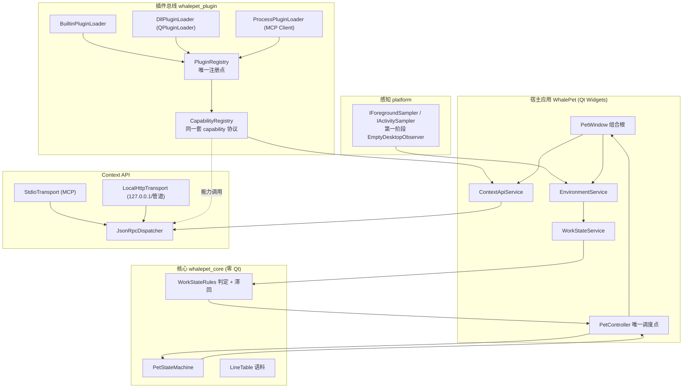

## 产品概述
在现有桌面宠物基础上，把它扩展为一个「插件化智能桌宠系统」：桌宠不再只是被点击、投喂的看板娘，而是能感知用户当前在电脑上做什么、判断其工作状态、并据此主动改变自身行为，同时把这份「当前上下文」以标准接口开放给 AI Agent。原有养成、梗聊天、小游戏等功能全部保留。

## 核心功能
1. **桌面环境感知**：采集前台窗口标题、所属应用/进程名，以及键鼠活动频率与空闲时长（只统计次数与时长，不读取任何输入内容）。
2. **工作状态判定**：把采样结果归纳为可用的工作状态（空闲、阅读、编码、调试、浏览器、会议、游戏、挂机等），并给出置信度。
3. **Coding 与 Vibe Coding 区分**：依据所处应用、输入节奏、连续编辑时长、空闲间隔等信号，识别用户是在「精耕细作地写代码」还是「快速由 AI 辅助生成、试错式开发」。
4. **状态驱动桌宠行为**：状态变化时切换立绘与台词——编码专注时不打扰、一段结束后出现、长时间无进展时关心、Vibe Coding 时活泼围观；拖拽、游戏、设置面板打开时保持不打断。
5. **本地 Context API**：对外提供仅本机可访问的上下文接口，可查询环境快照、当前工作状态、养成状态与会话统计，并提供工具调用能力。
6. **插件化集成**：感知、状态判定、桌宠行为、Context 提供均可拆为插件；插件支持三种接入形态——随主程序编译的内置插件、可独立发布的动态插件、独立进程插件（语言无关、崩溃隔离），三者共用同一套能力协议，宿主不感知插件来源。
7. **MCP 协议扩展**：既作为服务端向 AI Agent 暴露上下文与工具，也作为客户端把外部 MCP 能力接入以扩展桌宠功能。
8. **ACP / IDE Agent 预留**：预留外部显式信号源（IDE 扩展、Agent 会话、文件保存/差异事件）与会话桥接的抽象入口，先定接口、不实现具体协议。

## 交付范围
- 产出完整设计文档与分阶段路线图：模块划分、插件接口、数据流与状态流转、阶段优先级、集成路径。
- 落地第一阶段代码：通用插件总线 + 感知 / 状态 / Context API 的接口与空实现骨架，暂不接真实采集与真实网络监听。
- 给出「是否需要重构」的明确结论，并保证现有小游戏插件与既有全部测试零回归。

## 视觉与交互效果
- 外观沿用现有 92 张立绘与气泡体系，不新增美术资源；新增的工作状态表现通过复用既有姿态搭配新增语料文本体现。
- 状态切换表现为立绘柔和过渡加一句气泡短句；专注编码期间主动静默，仅在状态显著变化时出现。


## 一、技术选型

| 项 | 选择 | 说明 |
|---|---|---|
| 语言/标准 | C++17 | 沿用现有，不改标准 |
| UI | Qt 6.8.4 **Widgets**（Fusion + 全局 QSS） | 沿用现有，外观只走 `resources/qt-ui/` |
| 序列化 | `QJsonDocument` / `QJsonObject`（Qt6::Core） | JSON-RPC 与 capability 参数；不引第三方 JSON 库 |
| 新增 Qt 官方模块 | **Qt6::Network**（`QTcpServer` / `QLocalServer`） | 本地通道骨架；`Qt6::HttpServer` 作为可选（需在 `docs/BUILD.md` 记录可获取性，缺失时降级） |
| 数据 | Qt6::Sql（QSQLITE） | 沿用；新增设置项走 `SettingsData::json_ext`，**不建新列** |
| 插件加载 | 静态注册 + `QPluginLoader`（Qt 官方）+ 外部进程 stdio JSON-RPC | 三层共用一套 capability 协议 |
| 测试 | Qt6::Test + CTest | 沿用 `-o -,txt` / `SKIP_RETURN_CODE 77` / `offscreen` 既有约定 |
| 构建 | CMake 4.4.2 + VS 18 2026 x64 | 沿用 `vs-debug` / `vs-release` preset |

约束口径变更：由「零新依赖」收敛为「**零第三方依赖，允许 Qt 官方模块**」，需同步写入 `docs/README.md` §五 与 `docs/ARCHITECTURE.md` §2/§8 并记录该决策变更。

## 二、重构评估结论（先回答用户的问题）

**结论：不需要推倒重来，采用「渐进式泛化 + 净增层」。**

| 现有资产 | 处置 |
|---|---|
| `whalepet_core`（零 Qt 纯逻辑，可脱 UI 单测） | 直接复用；新增工作状态判定纯逻辑 |
| `src/minigame/MiniGamePlugin.h`（元数据 + Context 依赖注入 + 接口） | **泛化为通用插件总线模板**；`IMiniGamePlugin` / `MiniGameView` 保留为兼容层 |
| `MiniGameRegistry`（注册表 + 唯一注册点 + 宿主零分支） | 泛化为 `PluginRegistry` / `CapabilityRegistry`，`MiniGameRegistry` 收敛为薄适配，**签名与语义不变** |
| `viewmodel` Service 编排 + `PetController` 唯一调度点 | 复用；新增 `EnvironmentService` / `WorkStateService` |
| `model` SQLite + `json_ext` 扩展机制 | 复用；感知与 API 开关落 `json_ext` |
| View 层 Qt Widgets | 复用；桌宠行为由工作状态驱动，不改渲染栈 |

现有代码中**完全没有**网络 / IPC / 动态加载痕迹，因此感知层、插件宿主、Context API 均为**净增**；唯一需要动既有代码的是「注册表泛化 + 状态机新增通道 + 组合根装配」三处小改。

## 三、实现方案

### 3.1 关键决策

1. **插件总线泛化**：把既有「元数据（`PluginInfo` 对应 `MiniGameInfo`）+ 依赖注入（`PluginContext` 对应 `MiniGameContext`）+ 注册表 + 唯一注册点 + 宿主零分支」语义抽为通用组件，落在新静态库 `whalepet_plugin`。`registerBuiltinMiniGames()` 改为转调 `registerBuiltinPlugins()`，**保持调用点与断言不变**，`test_smoke` 的「小游戏…」子菜单断言零回归。
2. **统一 capability 协议**：三层插件都以 `CapabilityDescriptor` 声明能力并注册进同一个 `CapabilityRegistry`；调用统一走 `ICapability::invoke(QJsonObject in, InvokeContext&, QJsonObject& error)`，异步结果经 `InvokeContext` 回投。宿主与传输通道只按 id 查找，不感知来源层。
3. **三层加载器**：
   - `BuiltinPluginLoader`：进程内静态注册，零成本，最高优先级。
   - `DllPluginLoader`：`QPluginLoader` 加载 DLL，DLL 内导出 Qt 插件接口（IID 版本化，稳定 ABI 边界）+ `Q_PLUGIN_METADATA` 内嵌 JSON 元数据；版本不匹配 / 加载失败 → **记录日志并跳过**，不影响主进程，能力 id 加来源前缀避免冲突。
   - `ProcessPluginLoader`：外部进程作为 MCP Server，主程序作为 MCP Client 经 stdio JSON-RPC 拉起，`tools/list` 发现能力并映射为 capability；负责启动/握手/心跳/超时/重启/退出清理，崩溃隔离。
4. **感知层接口化**：`src/platform/DesktopObserver.h` 定义 `IForegroundSampler` / `IActivitySampler` / `ISystemStatusSampler`，输出 POD `EnvSample`；第一阶段只提供 `EmptyDesktopObserver`（返回 unknown，不采集），真实 Win32 实现（`GetForegroundWindow` / `GetWindowTextW` / `GetWindowThreadProcessId` / `QueryFullProcessImageNameW` / `GetLastInputInfo` / 低级键鼠钩子仅计数）留待后续阶段。接口本身可注入、可被单测替身覆盖。
5. **工作状态判定为纯逻辑**：`src/core/WorkStateRules.h/.cpp`（零 Qt）实现 `WorkState` 判定 + 置信度 + **滞回**（最短驻留时长 `kWorkStateMinDwellMs`、切换阈值），参数集中在常量表；判定输入是「可注入的时间戳 + `EnvSample` 序列」，因此可脱 UI 单测。Coding 与 Vibe Coding 的可操作判据：IDE 类进程在前台 + 输入节奏（连续 burst vs 稀疏长思考）+ 连续编辑时长 + 终端/浏览器切换占比 + 空闲间隔。
6. **状态驱动桌宠行为**：`PetController` 新增 `setWorkState(const core::WorkStateSample &)` 通道；状态机内把工作态作为新的「时段态」插入既有优先级链（一次性事件 > 工作态 > 时段态（夜/睡）> 挂机态 > 默认），并沿用「不打断」规则（拖拽中 / 小游戏或设置打开时抑制）。表现**复用既有立绘与 pose 名**，只新增语料文件 `assets/lines/work.txt`（纯文本资源，登记 `assets.qrc`）。
7. **Context API 双通道**：`contextapi/` 内 `JsonRpcDispatcher` 是唯一分发核心（method 表 + 统一错误码 + capability 转发），`StdioTransport`（MCP，面向 Agent）与 `LocalHttpTransport`（面向工具/调试 UI）都是薄适配，共用同一 dispatcher 与同一 capability 注册表。访问控制：仅绑定 `127.0.0.1` / 本地命名管道，可选 token（落 `json_ext`），默认拒绝非本机来源。
8. **ACP / IDE 预留**：只定义两个抽象 `ISignalSource`（外部显式信号：IDE 扩展、Agent 会话、文件保存/差异事件）与 `IAgentBridge`（会话生命周期 + 事件推送），第一阶段仅接口 + 空实现，不实现协议，避免过度设计。

### 3.2 系统架构



数据流与状态流转：`采样（1s 级）→ EnvSample → WorkStateRules 判定 + 滞回 → WorkStateSample → PetController → PetStateMachine（优先级 + 不打断）→ PoseResult → PosePresenter → 立绘与气泡`；对外方向：`能力/上下文查询 → CapabilityRegistry / ContextSnapshot → JsonRpcDispatcher → Stdio(MCP) 或本地通道`。

### 3.3 性能与可靠

- 采样每次 O(1)（一次 API 调用 + 原子计数读取），判定为常量表比较 O(状态数)；1s 级采样复用既有定时器机制，不新增轮询热点。
- capability 分发为哈希查找 O(1)；DLL 与外部进程调用一律带超时（默认 2s）与失败熔断，禁止阻塞 GUI 线程——外部进程 RPC 走异步回调。
- 外部进程插件崩溃隔离：进程退出被检测并仅使该来源能力标记为不可用，不触发主进程退出。
- 不新增每帧开销：立绘与动效链路完全不动。

## 四、执行注意事项

- **复用既有约定**：日志沿用 `qWarning()/qInfo()` + `[模块]` 前缀（同 `main.cpp`）；错误一律不静默（缺失资源告警 + 降级）。
- **CMake**：`find_package(Qt6 REQUIRED COMPONENTS ... Network)`；`CMAKE_AUTORCC ON` 保持不变；新增 qrc 条目（`assets/lines/work.txt`）必须登记，否则资源静默失效（见 `docs/traps-P1.md`）。
- **测试纪律**：新增测试沿用 `COMMAND test_xxx -o -,txt`、`SKIP_RETURN_CODE 77`、`QT_QPA_PLATFORM=offscreen`；严禁删除既有断言 / 放宽条件 / 注释用例（`docs/TESTING.md`）。
- **兼容红线**：`registerBuiltinMiniGames()` 名称与语义、`IMiniGamePlugin` / `MiniGameView` 定义、`PetController` 既有公开方法全部保持可用；`test_smoke` 对「小游戏…」子菜单结构的断言必须继续通过。
- **崩溃处理**：严格遵守 `docs/README.md` §六——出现崩溃即停止编译/构建/测试/复现，不得加插桩或改代码试探，如实记录并交回用户。
- **打包同步**：新增 DLL 插件目录（如 `plugins/`）需同步 `packaging/make-package.ps1`、`packaging/whalepet.nsi` 与 `docs/packages.md` 的「三处对应表」；第一阶段若无 DLL 产物，先落文档约定。
- **设置项**：感知开关、API 端口、token 一律写 `SettingsData::json_ext`（缺省即默认值），由 `SettingsRepo` 统一读写，保留未知键。

## 五、目录结构

```
desktoppet/
├── CMakeLists.txt                      # [MODIFY] find_package 增加 Network；新增三个静态库目标与 4 个测试目标
├── assets/
│   ├── assets.qrc                      # [MODIFY] 登记 work.txt
│   └── lines/work.txt                  # [NEW] 工作状态语料（sceneKey|台词，复用现有格式）
├── src/
│   ├── core/
│   │   ├── PetTypes.h                  # [MODIFY] 新增 EventType::WorkStateChanged 与工作态时间常量（零 Qt）
│   │   ├── PetStateMachine.h/.cpp      # [MODIFY] 接入工作态通道：插入优先级链、维持「不打断」
│   │   ├── WorkState.h                 # [NEW] WorkState 枚举 + WorkStateSample + 判定常量（零 Qt）
│   │   └── WorkStateRules.h/.cpp       # [NEW] Coding/Vibe Coding 判据 + 置信度 + 滞回（可注入时钟与采样序列）
│   ├── platform/
│   │   ├── DesktopObserver.h           # [NEW] IForegroundSampler / IActivitySampler / ISystemStatusSampler + EnvSample
│   │   └── EmptyDesktopObserver.h/.cpp # [NEW] 第一阶段空实现（返回 unknown，不采集），供注入与单测
│   ├── plugin/
│   │   ├── Capability.h                # [NEW] CapabilityDescriptor / ICapability / InvokeContext / 错误码
│   │   ├── PluginInterface.h           # [NEW] IPlugin / PluginContext / PluginInfo（泛化自 MiniGamePlugin.h）
│   │   ├── PluginRegistry.h/.cpp       # [NEW] 通用插件 + 能力注册表；registerBuiltinPlugins() 唯一注册点
│   │   ├── MiniGameCompatAdapter.h/.cpp# [NEW] IMiniGamePlugin → IPlugin 适配（capability kind=minigame），既有链路零改动
│   │   ├── builtin/BuiltinPluginLoader.h/.cpp  # [NEW] 进程内静态注册装载
│   │   ├── dll/IPluginFactory.h        # [NEW] DLL 侧导出接口（IID 版本化的稳定 ABI 边界）
│   │   ├── dll/DllPluginLoader.h/.cpp  # [NEW] QPluginLoader + JSON 元数据握手 + 版本协商 + 失败降级
│   │   └── process/ProcessPluginLoader.h/.cpp  # [NEW] 外部进程：MCP Client 拉起/握手/心跳/tools-list/超时重启/清理
│   ├── viewmodel/
│   │   ├── EnvironmentService.h/.cpp   # [NEW] 采样调度（1s 级）+ 变更广播
│   │   ├── WorkStateService.h/.cpp     # [NEW] 判定编排 + 变化去抖 + 上报 PetController
│   │   └── PetController.h/.cpp        # [MODIFY] 新增 setWorkState 入口 + 工作态表现映射
│   ├── contextapi/
│   │   ├── ContextSnapshot.h/.cpp      # [NEW] 本地 context 数据模型（环境/工作状态/养成/会话统计）
│   │   ├── JsonRpcDispatcher.h/.cpp    # [NEW] 唯一分发核心：method 表 + capability 转发 + 统一错误码
│   │   ├── ContextApiService.h/.cpp    # [NEW] 组装 dispatcher + capability 表 + 通道 + 访问控制
│   │   ├── transport/StdioTransport.h/.cpp     # [NEW] MCP stdio JSON-RPC 通道骨架
│   │   ├── transport/LocalHttpTransport.h/.cpp # [NEW] 本地 HTTP/命名管道通道骨架（127.0.0.1 + 可选 token）
│   │   ├── ISignalSource.h             # [NEW] IDE/ACP/文件事件等显式信号源预留接口（仅接口）
│   │   └── IAgentBridge.h              # [NEW] ACP/IDE Agent 会话桥接预留接口（仅接口）
│   └── minigame/
│       └── MiniGameRegistry.h/.cpp     # [MODIFY] 收敛为 PluginRegistry 的薄适配，签名与语义不变
├── src/model/
│   ├── SettingsData.h                  # [MODIFY] json_ext 新增感知开关 / API 端口 / token 字段
│   └── SettingsRepo.h/.cpp             # [MODIFY] 上述键的读写与缺省（不建新列，保留未知键）
├── src/view/PetWindow.h/.cpp           # [MODIFY] 组合根装配 EnvironmentService / WorkStateService / ContextApiService（受设置门控）
├── tests/
│   ├── test_plugin_registry.cpp        # [NEW] 注册表/能力查找/三层优先级/小游戏兼容适配
│   ├── test_platform_skeleton.cpp      # [NEW] 空实现语义、接口注入、unknown 降级
│   ├── test_work_state.cpp             # [NEW] 各状态判定、Coding vs Vibe Coding、滞回与最短驻留、置信度
│   └── test_context_dispatch.cpp       # [NEW] JSON-RPC 分发、method 表、错误码、双通道共用注册表
└── docs/
    ├── PLUGIN-ARCHITECTURE.md          # [NEW] 模块划分、插件接口、capability 协议、三层加载、数据流与状态流转
    ├── CONTEXT-API.md                  # [NEW] Context 数据模型、方法/工具集合、双通道规范、访问控制、ACP 预留
    ├── ROADMAP-P7-Fin.md                   # [NEW] 分阶段优先级（骨架 → 真实采集 → DLL/进程 → ACP 集成）
    ├── traps-P7.md                     # [NEW] 本阶段真实踩坑记录（先建骨架，事实驱动追加）
    ├── README.md                       # [MODIFY] 索引新增文档；§五「不做」与「零新依赖」口径更新
    ├── ARCHITECTURE.md                 # [MODIFY] 分层图新增 platform / plugin / contextapi；依赖口径更新
    ├── STATE-MACHINE.md                # [MODIFY] 状态集合与优先级新增工作态通道、事件表新增 WorkStateChanged
    ├── SETTINGS.md                     # [MODIFY] 新增感知/API 设置项（json_ext）
    └── packages.md                     # [MODIFY] 插件目录的三处对应表与分发约定
```

## 六、关键接口（仅接口级定义）

```cpp
// src/plugin/Capability.h —— 三层插件共用的唯一能力协议
enum class PluginOrigin { Builtin, Dll, Process };

struct CapabilityDescriptor {
    QString id;            // 稳定标识，如 "minigame.minesweeper" / "context.snapshot" / "ext.foo.bar"
    QString version;       // 语义化版本，用于协商
    QString displayName;
    QString description;
    PluginOrigin origin = PluginOrigin::Builtin;
    bool readOnly = true;  // context 类只读；工具类可写
    QString paramsSchema;  // 轻量参数描述（JSON 字符串），第一阶段不做完整 JSON Schema
};

class ICapability {
public:
    virtual ~ICapability() = default;
    virtual CapabilityDescriptor descriptor() const = 0;
    // 同步实现返回 true 并填充 out；异步实现返回 false 并经 ctx 回投。
    // 失败时填 error（含 code / message），禁止抛异常穿越边界。
    virtual bool invoke(const QJsonObject &in, InvokeContext &ctx, QJsonObject &out, QJsonObject &error) = 0;
};

// src/plugin/PluginInterface.h —— 泛化自现有 MiniGamePlugin.h 的语义
struct PluginContext {                 // 对应现有 MiniGameContext
    viewmodel::PetController *controller = nullptr;  // 表现播报（可空）
    model::Database *db = nullptr;                   // 持久化（可空 = 内存态）
    class CapabilityRegistry *capabilities = nullptr; // 插件间互相发现能力（可空）
};

class IPlugin {
public:
    virtual ~IPlugin() = default;
    virtual PluginInfo info() const = 0;                 // 元数据驱动菜单/设置页（对应 MiniGameInfo）
    virtual void registerCapabilities(CapabilityRegistry &registry) = 0;
    virtual bool start(PluginContext &ctx) { Q_UNUSED(ctx); return true; }  // 生命周期钩子
    virtual void stop() {}
};
```

```cpp
// src/core/WorkState.h —— 零 Qt，可脱 UI 单测
enum class WorkState { Unknown, Idle, Reading, Coding, VibeCoding, Debugging, Browsing, Meeting, Game, Afk };

struct EnvSample {                 // 由 platform 层产出，第一阶段恒为 unknown
    std::string appId;             // 进程名（小写）
    std::string windowTitle;
    bool hasInput = false;
    std::int64_t idleMs = 0;       // 距最近一次输入的空闲时长
    int inputEvents = 0;           // 本采样窗口内键鼠事件数（只计数）
    std::int64_t nowMs = 0;
};

struct WorkStateSample {
    WorkState state = WorkState::Unknown;
    double confidence = 0.0;       // 0..1
    std::int64_t sinceMs = 0;      // 进入该状态的时间戳（滞回用）
};
```


## Agent Extensions

### Skill
- **qt-msvc-cmake**
  - Purpose: 按固定基线（Qt 6.8.4 + MSVC VS 18 2026 + CMake 4.4.2）完成新增静态库目标、`find_package(Qt6 ... Network)`、`offscreen` 测试与部署验证。
  - Expected outcome: 新增的 `whalepet_plugin` / `whalepet_platform` / `whalepet_contextapi` 目标可 configure/build，CTest Debug 与 Release 全绿，产物路径符合 `deploy-release/` 约定。
- **debug**
  - Purpose: 实施过程中一切构建/链接/运行时报错按「先复现→再定位→最小修复→可观测验证→登记踩坑」闭环处理，结果写入 `docs/traps-P7.md`。
  - Expected outcome: 每条真实问题均有可复现步骤与根因记录；不出现删除断言、放宽条件、吞异常等伪装成功；命中崩溃时按规范交回用户。
- **lsp-code-analysis**
  - Purpose: 泛化 `MiniGameRegistry` 与修改 `PetController` / `PetWindow` / `PetStateMachine` 前，用语义级导航确认定义、引用与实现，避免漏改调用点造成回归。
  - Expected outcome: 输出受影响的符号清单（定义/引用/实现），保证 `registerBuiltinMiniGames()` 与既有小游戏链路调用点全部被覆盖。

### SubAgent
- **code-explorer**
  - Purpose: 定位现有小游戏插件链路、设置读写链路与测试断言的完整调用面，作为泛化改造的兼容性基线。
  - Expected outcome: 产出「必须保持不变的公开接口与断言清单」，确保 12 个既有测试目标零回归。
