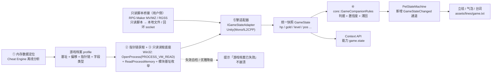

# ROADMAP · EX1 — 游戏内存陪玩（Cheat Engine 分析 + 运行期只读感知）

> 本文件是 **P0–P7 之后的扩展（Extension）路线图**：让 WhalePet 桌宠在用户游玩的
> **个人单机 / 离线**游戏运行时，以**只读**方式感知游戏状态（血量 / 金币 / 等级 / 坐标等），
> 并给出**不打扰**的陪伴式反馈。
>
> **前置**：P0–P7 **全部交付完成**（`docs/README.md` §二.3；版本 0.2.0，31 个测试目标 Debug / Release 各 31/31）。
> **定位依据**：`docs/ARCHITECTURE.md`（分层）、`docs/PLUGIN-ARCHITECTURE.md`（能力总线）、
> `docs/CONTEXT-API.md`（对外能力）、`docs/ACP-EVAL.md`（CDP / 本机回环评估）、
> `docs/README.md` §六（崩溃一律交回用户）。
> **踩坑记录**：`docs/pitfalls/`（本阶段实施时创建；命名沿用 `docs/pitfalls/` 规范）。

---

## 【红线】能力边界（贯穿全文，不可协商）

1. **全程只读**：仅以 `PROCESS_VM_READ | PROCESS_QUERY_INFORMATION` 打开目标进程，
   **绝不**申请 `PROCESS_VM_WRITE / PROCESS_VM_OPERATION`；**不写入、不 patch、不注入、不 hook、
   不绕过完整性校验**。本功能是「观察者」，不是「修改器」。
2. **仅个人单机 / 离线自用**：**明确禁止**用于联机、多人、对抗性（竞技 / 排行榜）场景。
   任何带反作弊（EAC / BattlEye / 内置 anti-cheat / anti-tamper）的游戏**一律不支持**。
3. **数据不出本机**：采集结果仅用于本机桌宠表现，**不上传、不回传、不联网**；
   与 P7 感知层同口径，功能**默认关闭**，关闭时**零开销**（不打开任何进程）。
4. **风险自担**：使用前须由用户自行确认目标游戏的**服务条款（ToS）与许可**；
   违反 ToS 或当地法规的后果由用户承担（见「四、风险与限制」）。

---

## 一、目标

### 1.1 总体目标

让 WhalePet 在用户**玩单机游戏**时，实时感知游戏状态并做出陪伴式反馈：

- **实时感知**：轮询/事件驱动地读取一组用户选定的游戏字段（血量、金币、等级、坐标、地图名、物品数等），
  转换为统一的 `GameState` 快照。
- **陪伴式反馈**：依据快照变化驱动桌宠**立绘切换 / 气泡台词 / 里程碑播报**，
  并可将快照作为 `game.state` 能力经本地 Context API 暴露给外部 Agent。
- **不打扰**：沿用 P7 的「让位」与静默原则——工作态（`busy`）、深夜 `sleep`、挂机 `afk` 时
  游戏陪玩表现**让位**，不抢占已有的一次性小剧场。

### 1.2 目标引擎范围

| 范围 | 引擎 | 说明 |
|---|---|---|
| **保证支持（本路线图必须落地）** | **Unity**（`Mono` 与 `IL2CPP` 两种脚本后端） | 走**外部只读内存**，见 §2.6.1 |
| **保证支持（本路线图必须落地）** | **RPG Maker MV / MZ**（NW.js / JavaScript） | 主走 **CDP 只读求值**，见 §2.6.2；**不走**经典内存扫描 |
| **保证支持（本路线图必须落地）** | **RPG Maker XP / VX / VX Ace**（RGSS / Ruby） | 主走 **只读脚本桥接（方案 B）**，见 §2.6.3；**无 CDP 可用** |
| **仅提供接口（不作实现要求）** | RPG Maker 2000/2003、Godot、Unreal、自研引擎等 | 只保留统一抽象 `IGameStateAdapter` 与「游戏档案」契约（best-effort 通用指针链，§2.6.4），后续按需接入 |

### 1.3 明确不做（Out of Scope）

- **不做任何写入 / 修改**：不改数值、不改存档、不做「外挂」式功能。
- **不支持联机 / 对抗性游戏**：不针对任何反作弊做对抗、绕过或规避。
- **WhalePet 本体不注入目标进程**：不采用 `CreateRemoteThread` / DLL 注入 / BepInEx 等注改路线
  （仅作为**风险对照**在文档中说明，不实施）。
  > **例外说明**：RGSS 分支的「**只读脚本桥接**」（§2.6.3）由**用户自行**在游戏侧放置
  > **只读**脚本，把状态投递到本机文件 / 回环 socket；**WhalePet 本体不注入、不 hook、不写值**，
  > 与 MTool 式注入有本质区别（见 §2.6.5）。
- **不引入第三方依赖**：读取底座用 Win32 官方 API（`kernel32`）与 Qt 官方模块；
  Cheat Engine / Il2CppDumper 仅为**离线分析工具**，不是运行期依赖，不随包分发；
  **不集成 MTool**（§2.6.5）。
- **不做跨平台**：项目定位为仅 Windows（`docs/README.md` §三 决策 2），
  CE 与 `ReadProcessMemory` 路线亦为 Windows 专属。

### 1.4 与既有架构的关系

EX1 **不推倒重来**，完全复用 P7 已建立的「感知 → 判定 → 表现 → 对外」链路：

```
  platform（观察者）        core（纯逻辑判定）        viewmodel（编排）         contextapi（对外）
  IEnvironmentObserver ──►  ?GameCompanionRules  ──►  新 GameState 服务   ──►  game.state 能力
  （新增 IGameMemoryReader）  （置信度/滞回，同构）      （PetController）        （JSON-RPC）
```

---

## 二、技术路径

### 2.1 四环节总览（数据流）



> **核心原则**：① 由人（CE）离线完成；②③④ 由 WhalePet 运行期完成。
> CE **不是运行期依赖**，保证产品仍是「双击即用」的独立桌宠。
> 取数有**两条只读通道**：**外部只读内存**（Unity / 通用引擎）与**用户侧只读脚本桥接**
> （RPG Maker MV/MZ 无调试端口时，以及 RGSS，见 §2.6）；两条通道都**不注入、不写值**。

### 2.2 环节一：内存数据定位（Cheat Engine 离线分析）

**角色**：由**人在开发期**用 Cheat Engine（CE）对目标游戏做一次性分析，产出后续运行期所需的
「游戏档案」。运行期 WhalePet 本体**不加载、不依赖 CE**。

**工作流**（方法论，单机 / 离线自用）：

1. **确定数值**：在游戏内观察一个已知量（如金币），用 CE 的「精确数值扫描」逐步缩小候选地址；
   对会变化的量（血量）用「未知初值 → 变化/未变化」扫描。
2. **区分显示值与真值**：多数游戏 UI 显示的是格式化副本，真值在脚本/逻辑层；优先找**逻辑层**变量。
3. **判定数据类型**：`int32 / float / double / bool`，确认字节跨度（避免把 `int64` 当 `int32`）。
4. **找基址（静态根）**：对候选地址做「谁访问了这个地址」，再回溯到**模块基址 + 静态偏移**的
   稳定根；直接依赖动态绝对地址在重启后必然失效。
5. **记录结构体布局**：确认相邻字段（如 `pos.x/y/z` 连续）、对象 vtable/魔数等，供有效性校验。

**产物**：一张待填入「游戏档案」的清单：模块名、静态根偏移、各级指针偏移、字段偏移与类型、校验魔数。

> ⚠️ **版本漂移**：游戏更新几乎必然导致偏移失效。CE 分析是**可重复的工序**，
> 本路线图要求「偏移数据化 + 失效自检」，把重新分析的成本降到「只更新一个 JSON」。

### 2.3 环节二：指针链获取（模块基址 + 偏移；处理 ASLR / GC）

**指针链（pointer chain）** = `模块基址 → [静态根偏移] → 指针 + 偏移 → … → 字段地址`。

- **ASLR**：Windows 下模块基址每次启动随机，**必须**运行时枚举基址，禁止硬编码绝对地址。
  基址获取：`CreateToolhelp32Snapshot(TH32CS_SNAPMODULE|TH32CS_SNAPMODULE32, pid)`
  + `Module32First/Next`（或 `EnumProcessModules`）。
- **指针链解析**：从根地址出发，逐级 `ReadProcessMemory` 读出指针，再 +偏移，直到末级；
  每跳都做**可读性 / 范围校验**（见 §2.4），任一跳失败即整条链作废。
- **有界跳数**：约定最大跳数（建议 **≤ 4 跳**）与单次读取总字节上限，防止误配置导致大范围盲读。

**Unity 的 GC 特有问题**：Unity 托管堆对象地址会**移动**，因此：

- **锁静态根**：优先锚定**静态字段 / 单例静态引用**（它们在类元数据中位置稳定），
  再沿指针链进入托管对象；不要缓存托管对象地址。
- **每次读取复核**：每轮采样重新走链 + 校验魔数/版本号，不做跨帧地址缓存。
- **Mono vtable 静态字段区**：Mono 后端静态字段数据可由 `mono_vtable_get_static_field_data`
  一类导出获得（见 §2.6.1）。

### 2.4 环节三：外部程序只读读取（数据驱动「游戏档案」）

**底座 API 与资源**（仅需 `kernel32`；WhalePet 为 x64 进程）：

| 步骤 | API | 要点 |
|---|---|---|
| 打开进程 | `OpenProcess(PROCESS_VM_READ \| PROCESS_QUERY_INFORMATION, FALSE, pid)` | **只读权限**；失败即优雅退出 |
| 枚举模块基址 | `CreateToolhelp32Snapshot` + `Module32First/Next` | 定位 `GameAssembly.dll` / `mono.dll` / `nw.exe` 等 |
| 读内存 | `ReadProcessMemory` | 返回值必须校验；失败不视为异常 |
| 关闭句柄 | `CloseHandle` | RAII 封装，异常路径也释放 |

**数据驱动设计**：所有游戏相关参数放在**外部可替换的「游戏档案（profile）」**里，而非硬编码；
读取器只认 profile 契约。这样新增游戏 = 新增一个 JSON。

**失效自检与优雅降级**（强约束，与项目「失败不伪造数据」一致）：

- 每级指针 / 每字段读取都校验：`ReadProcessMemory` 返回真、地址落在目标进程合法范围、
  魔数/版本号匹配；
- 连续 N 次（如 3 次）校验失败即判定「档案失效」：**停止读取、提示用户、不动桌宠状态**，
  **绝不崩溃、绝不显示伪造数据**；
- 目标进程退出 / 模块卸载时**自动停止**并释放句柄。

**线程与预算**：读取在独立定时器/工作线程执行，避免阻塞 UI；每轮采样受「字段数 × 跳数 × 字节数」预算约束。

> 本节的「外部只读内存」是**通道一**；RGSS / MV-MZ 脚本层取数走**通道二（只读脚本桥接，§2.6.3）**。

### 2.5 环节四：桌宠交互逻辑（复用既有链路）

**统一快照模型**（拟新增于 `whalepet_core`，纯 C++17、零 Qt UI 依赖，可脱 UI 单测）：

```cpp
// 示意（最终以实现为准）
struct GameSample {           // 一轮原始读数
    bool available = false;   // 目标进程/档案是否可用（不可用不伪造）
    double hp = 0, hpMax = 0;
    long long gold = 0;
    int level = 0;
    double posX = 0, posY = 0;
    std::string mapName;      // 可选
    int specialScene = 0;     // 特殊场景 CG（0 无 / 1 图片 / 2 专用场景 / 3 影片 / 4 对话演出；见 §2.6.2.1）
    std::int64_t nowMs = 0;
};
struct GameCompanionSample {  // 判定结果（含置信度/滞回），与 WorkStateSample 同构
    int mood = 0;             // 如 危险/正常/庆祝
    double confidence = 0.0;
    std::int64_t sinceMs = 0;
};
```

**判定规则**：新增 `core::GameCompanionRules`，**刻意照搬** `core::WorkStateRules` 的
「`candidate()` 纯函数归一化 + `evaluate()` 置信度/最短驻留滞回」写法
（见 `src/core/WorkStateRules.h:47` / `:54`、`src/core/WorkState.h:120`），保证可逐条单测。

**驱动状态机**：新增 `EventType::GameStateChanged`（`src/core/PetTypes.h` 的 `EventType` 枚举，
紧随既有 `WorkStateChanged`），走 `PetStateMachine::handle(const Event&)`
（`src/core/PetStateMachine.h:20`）。**让位优先级**：一次性事件 > 工作态 > 时段态(夜/睡) >
挂机态(afk/thinking/waiting) > **游戏陪玩态** > 静息态——即游戏陪玩**不得**打断
工作专注、深夜静默与既有一次性表现（`contextPose()`，`src/core/PetStateMachine.cpp:59-93`）。

**特殊场景静默**：当 `GameSample.specialScene != 0`（检测见 §2.6.2.1）时，桌宠进入**静默陪伴**——
不弹气泡、不主动播报，仅保留立绘与既有点击交互；离开特殊场景后自动恢复。

**台词**：新增 `assets/lines/game.txt`（现有 `assets/lines/` 已有 `game.txt`，见 §2.8），
键名沿用「场景 key | 台词」格式，经 `core::LineTable::pick()`（`src/core/LineTable.h:30`）取用。

**设置**：新增开关（如 `game_companion_enabled`，默认 **false**），落 `settings` 表的
`json_ext`（先例键：`chess_engine_path` / `work_aware_enabled`，见 `src/model/SettingsRepo.cpp`）。

**对外能力**：经 `whalepet.context` 内置能力插件新增 `game.state` 能力
（先例：`context.snapshot` / `context.workState`，见 `src/contextapi/builtin/ContextCapabilities.cpp`）。

**可选主动模式**：仅在高置信度的**里程碑事件**（升级 / BOSS 击杀 / 濒死 / 通关）下主动播报，
其余状态变化只在用户交互时呈现——遵循「不打扰」。

### 2.6 引擎适配器（统一 `IGameStateAdapter`）

所有引擎实现同一抽象：`bool attach(pid) / bool read(GameSample&) / void detach()`。
profile 里声明 `engine` 字段，运行期按此选择适配器。

**两条只读取数通道并存**（由 `engine` 选择）：

1. **外部只读内存**（§2.4）：适用于有稳定静态根的进程 → Unity（§2.6.1）、通用引擎（§2.6.4）。
2. **只读脚本桥接**（机制见 §2.6.3）：适用于脚本运行时受 GC 管理、内存扫描不可靠的引擎
   → RPG Maker MV/MZ（无调试端口时，§2.6.2）、RPG Maker XP/VX/VX Ace（§2.6.3）。
   由**用户侧只读脚本**把状态投递到本机文件 / 回环 socket；WhalePet **只读取、不注入、不写值**。

> 「按运行时分支、脚本层优先」的结论受 **MTool** 覆盖面启发，但**不集成 MTool 本身**——详见 §2.6.5。

#### 2.6.1 Unity（Mono / IL2CPP）

**Mono 后端**（存在 `mono.dll`，脚本在 `Assembly-CSharp.dll` 等）：

- 可在运行期经 `mono.dll` 导出按**类名 / 字段名**解析：
  `mono_get_root_domain`、`mono_class_from_name`、`mono_class_get_field_from_name`、
  `mono_field_get_offset`、`mono_vtable_get_static_field_data`。
- 优点：不必硬编码字段偏移，按名字定位，抗版本漂移较强；
  缺点：需跨进程读 `mono.dll` 内部结构（本质仍是 `ReadProcessMemory`），
  且 Mono 结构布局随版本变化。
- **推荐混合**：静态根用 Mono 导出解析，实例字段用「偏移表」（由离线分析得到）。

**IL2CPP 后端**（脚本编译进 `GameAssembly.dll` + `global-metadata.dat`）：

- **离线工具链**：用 **Il2CppDumper / Cpp2IL** 从 `GameAssembly.dll` + `global-metadata.dat`
  导出 `dump.cs` / `script.json`（含类与字段偏移），**转换**为本路线图的「游戏档案」。
- 运行期：锚定 `Il2CppClass` 静态字段区 / 单例静态引用，再按偏移读实例字段。
- **限制**：`global-metadata.dat` 可能被加密 / 混淆 → 该场景**降级为通用 CE 指针链**路径（§2.6.4）。

#### 2.6.2 RPG Maker MV / MZ（NW.js / JavaScript）—— CDP 为主路径

**关键结论**：MV/MZ 的 `$gameParty / $gameVariables / $gameSwitches / $gamePlayer / $gameMap`
是 **V8 堆上的 JS 对象**，堆受 GC 管理，**用 CE 经典内存扫描极不稳定**。
因此 MV/MZ **不走**「扫内存 + 指针链」主路径，而采用以下三条（按优先级）：

| 优先级 | 方案 | 做法 | 代价 |
|---|---|---|---|
| **A（本分支主路径）** | **CDP 只读求值** | 让游戏以 `--remote-debugging-port=<port>` 启动，WhalePet 通过 **Chrome DevTools Protocol** 连接，仅用 `Runtime.evaluate` 读取 `$gameParty._gold` / `$gameVariables.value(n)` / `$gamePlayer.x` 等**纯读取表达式** | 需用户以调试参数启动游戏；无调试端口时不可用 |
| B（回退 / 无调试端口时） | **只读脚本桥接** | 提供一个**只读** MV/MZ 插件（或 NW.js 侧脚本），定时把状态投递到本机文件 / 回环 socket，WhalePet 侧读取（**机制与 §2.6.3 同构**） | 更稳定，但需用户安装插件并修改游戏 `js/plugins` |
| C（最后手段） | CE 扫描 | 仅当 A/B 均不可行时使用，且**明确标注不稳定** | 受 V8 GC 影响，易失效 |

> 方案 A 与项目既有 **Context API / CDP** 经验同源（见 `docs/ACP-EVAL.md`），
> 复用「本机回环 + JSON」的成熟模式；且 **A 全程只读**，不修改游戏任何内容。

##### 2.6.2.1 特殊场景 CG 检测（CDP 特征，只读）

**前提**：MV/MZ 是 **NW.js 单 canvas** 应用——图片 CG 在 DOM 中**没有节点**，
只能经 CDP 的 `Runtime.evaluate` 读 **JS 全局对象**；影片类可额外看 DOM `<video>`。
连接流程：`http://127.0.0.1:<port>/json` 列 target → WebSocket → `Runtime.enable` →
`Runtime.evaluate({expression, returnByValue:true})`（**只读表达式**）。

**四类实现路径与对应特征**：

| # | 实现路径 | CDP 可读特征 | 可靠性 |
|---|---|---|---|
| A | **Show Picture**（事件指令 `231`，最常见） | `$gameScreen.picture(id)` / 私有 `_pictures[id]` 的 `name()` / `opacity()` / `scaleX` / `scaleY` / `x()/y()` / `origin()` | 高（通用），需与图标/UI 图区分 |
| B | **专用 Scene / 插件自建 CG 场景** | `SceneManager._scene.constructor.name`（含 `CG` / `Gallery` / `Movie` / `Event` 等，或 profile 名单） | 高，但**名称依赖游戏/插件** |
| C | **影片**（事件指令 `261`） | MV `Graphics.isVideoPlaying()` / `Graphics._video`；MZ `Video.isPlaying()` / `Video._element`；DOM `<video>` | 很高（引擎级布尔量） |
| D | **消息窗立绘演出**（Face / Bust 插件，不走 `$gameScreen`） | `$gameMessage.isBusy()` / `faceName()` / `_texts` + 插件自定义全局 | 中（依赖插件实现） |

**辅助特征（均非充分条件）**：

- 画面特效：`$gameScreen.tone()` / `flashColor()` / `shake()` / `zoomScale()` / `weatherType()`
- 音频切换：`AudioManager._currentBgm`（CG 常换 BGM / 停 SE）
- 事件解释器：`$gameMap.isEventRunning()`、`$gameMap._interpreter._list[_index].code`
  （`231` 显示图片 / `235` 消除图片 / `261` 播放影片）
- 游戏自定义旗标：`$gameSwitches.value(n)` / `$gameVariables.value(n)`（最精确、最不可移植）

**统一只读探测表达式**（返回 `scene / pics / video`，纯读取，不调用任何写方法）：

```js
(function () {
  try {
    var s = SceneManager._scene;
    var out = { scene: (s && s.constructor) ? s.constructor.name : '', pics: [], video: false };
    if (typeof $gameScreen !== 'undefined' && $gameScreen._pictures) {
      var a = $gameScreen._pictures;
      for (var i = 1; i < a.length; i++) {
        var p = a[i];
        if (!p || typeof p.name !== 'function' || !p.name()) continue;
        out.pics.push({ id: i, n: p.name(), op: p.opacity(),
                        sx: p.scaleX(), sy: p.scaleY(), x: p.x(), y: p.y(), o: p.origin() });
      }
    }
    if (typeof Video !== 'undefined' && Video.isPlaying) out.video = Video.isPlaying();                          // MZ
    else if (typeof Graphics !== 'undefined' && Graphics.isVideoPlaying) out.video = Graphics.isVideoPlaying();   // MV
    else { var v = document.querySelector('video'); out.video = !!(v && !v.paused); }
    return JSON.stringify(out);
  } catch (e) { return JSON.stringify({ error: String(e) }); }
})()
```

**「全屏 CG」判据**：某图片 `op ≈ 255` 且渲染覆盖面积 ≥ 屏幕阈值（如 60%）——
`origin=0` 时约为 `bitmapW*scaleX/100 × bitmapH*scaleY/100`（起点 `(x, y)`）；
`origin=1` 时以 `(x, y)` 为中心向四周展开。原图尺寸需 `ImageManager` 缓存或 `Bitmap` 侧信息；
游戏差异大，**阈值由 profile 配置**。

**判定与抗抖**：按优先级投票——`video` → 专用场景名单 → 全屏图片 → 对话演出；
要求条件**连续 N 帧**成立才置位、**连续 M 帧**不成立才复位（复用 `GameCompanionRules` 滞回，§2.5）。
结果写入 `GameSample.specialScene`（0 无 / 1 图片 / 2 专用场景 / 3 影片 / 4 对话演出），
由桌宠据此进入**静默陪伴**（§2.5）。

**MV 与 MZ 差异**：图片与场景对象两代**基本同构**（`$gameScreen._pictures` / `SceneManager._scene`）；
差异集中在**影片**（MV `Graphics.playVideo` / `Graphics._video` vs MZ `Video.play` / `Video.isPlaying` / `Video._element`）
与 **Pixi 版本**（4 vs 5，影响像素回读）。影片检测统一为
「有 `Video.isPlaying` 就用它 → 否则 `Graphics.isVideoPlaying` → 否则 DOM `<video>`」。

**陷阱与对策**：

- **插件绕过 `$gameScreen`**（自定义图片层 / 直接 `Bitmap`/`Sprite` 绘制）→ A 失效；
  改读 `SceneManager._scene._spriteset._pictureContainer.children`（精灵层），或退化为截图。
- **WebGL 像素回读**：`canvas.toDataURL()` 在 Pixi 未开 `preserveDrawingBuffer` 时可能得到空白 →
  改用 CDP **`Page.captureScreenshot`**；截图**仅低频 / 事件触发**，避免性能开销。
- **事件指令码是瞬态**（`_interpreter._index` 指向已执行过的指令），仅作即时辅助，
  主判据用**图片 / 场景状态**。
- **影片可能在独立 NW.js 窗口**：遍历 `json` target 列表跨 target 查询。
- **调试端口未开**：整条通道不可用 → 优雅降级（§2.6.2 方案 B）。
- **只读红线**：表达式**禁止**调用 `showPicture` / `Video.play` 等**写**方法；不注入、不写值。

> 加密与插件混淆**不影响**本方案：JS 运行时状态经全局对象即可读，无需源码。

#### 2.6.3 RPG Maker XP / VX / VX Ace（RGSS / Ruby）—— 只读脚本桥接为主路径

**关键结论**：RGSS（Ruby Game Scripting System）**没有** MV/MZ 那样的 Chromium / 远程调试端口，
**无 CDP 可用**；Ruby 堆同样受 GC 管理，**外部扫内存 + 指针链不可靠**。
因此本分支的**主路径 = 只读脚本桥接（方案 B）**：

| 优先级 | 方案 | 做法 | 代价 / 风险 |
|---|---|---|---|
| **B（本分支主路径）** | **只读脚本桥接** | 由**用户自行**在游戏侧放置一份**只读** RGSS / Ruby 脚本，周期性把 `$game_variables` / `$game_party` / `$game_player` 等**读取后**投递到本机**文件**或**回环 socket**；WhalePet 侧只读取该输出 | 需用户对游戏脚本做一次性处理；**具体形态待实现阶段按游戏验证**（合入 `Data/Scripts` 需重打包 / 第三方 RGSS 加载器 / 游戏自带扩展点）；**只读、不写值、不改变游戏逻辑** |
| C（最后手段） | 通用指针链 | 仅当无法放置脚本时，降级到 §2.6.4 的通用指针链，且**明确标注不稳定** | Ruby GC 使地址易失效，不保证 |

**桥接输出契约（通道二通用）**：桥接脚本只**输出**一个结构化快照（JSON / 行分隔键值），
字段名与「游戏档案」的 `fields[].name` 对齐，并可携带与 `GameSample` 对齐的可选字段
（如 `specialScene`，使 RGSS 侧亦能上报特殊场景）；WhalePet 侧不向桥接回传任何控制指令。

**与「不注入」红线的关系**：桥接脚本由**用户**放置于游戏侧，**WhalePet 本体不注入、不 hook、不写值**；
这与 MTool 的**注入 + hook** 路线（§2.6.5）有本质区别。桥接**只输出**状态。

**待确认**：桥接的具体落地形态见 §五 Q9——是否需要用户重打包脚本、是否采用 RGSS 加载器，
由实现阶段按目标游戏确定；本路线图仅锁定「**只读脚本桥接**」这一主路径。

#### 2.6.4 通用引擎（仅接口，不作实现要求）

提供 **纯 CE 指针链** 的默认适配器：完全由 profile 驱动（模块 + 静态根偏移 + 指针链 + 字段偏移），
适用于任何有稳定静态根的本地进程。其它引擎（RPG Maker 2000/2003、Godot、Unreal、自研）
**只保留接口**，不保证可用，用户可自行填写 profile 尝试。

#### 2.6.5 关于 MTool 的可行性结论（仅借鉴，不集成）

> **结论**：MTool 证明了「多数 RPG Maker 系列可统一支持」在能力上成立，
> 但它本身**不可作为 WhalePet 的数据源**，也**不进依赖**。

| 维度 | 结论 | 依据 |
|---|---|---|
| 覆盖能力 | **成立** | MTool 以「主应用 + 每引擎插件」覆盖 RPG Maker 2000/2003、XP/VX/VX Ace、MV/MZ（及 Ren'Py 等），证明覆盖面不是技术瓶颈 |
| 集成可行性 | **不可行** | ① **无对外 API**：数据只经其私有 UI / 私有协议暴露，第三方须先逆向其本体；② **必须注入或由 MTool 启动游戏**，与本文档「不注入」红线冲突；③ **闭源、商业订阅**（基础免费 + ¥20/¥50/¥100 每月档位）、体积数百 MB，**不可随包分发**；④ **版本强耦合**（主体与插件需匹配、更新频繁）；⑤ 进程 / 端口易冲突 |
| 合规性 | **冲突** | MTool 含**写值修改与包解密**，属修改器范畴；引入会把桌宠从「只读观察者」拖入修改器生态，放大 ToS / 法律风险（§四） |
| 唯一合理用法 | **离线人工辅助** | 与 Cheat Engine 同级：仅用于**人工定位** RPG Maker 数值（其已内置解密与变量面板，比裸 CE 省事），定位后由 WhalePet 用**只读**路径复现。**不进运行期、不进依赖、不随包分发** |

**对本文档的启发（已并入）**：

1. **单一手段覆盖不了 RPG Maker 系列**，必须**按运行时分支**：
   MV/MZ 走 CDP（§2.6.2），**RGSS 走只读脚本桥接（§2.6.3）**，2000/2003 等仅留通用接口（§2.6.4）。
2. **脚本层优先**：对有脚本运行时的引擎，从脚本层取数是**只读且稳定**的正解，
   优先于对其 GC 堆做原始内存扫描。
3. **坚持不注入**：即便 MTool 证明注入式覆盖更广，本文档**覆盖率让位于红线**，不采用注入路线。

### 2.7 游戏档案（profile）契约

统一契约是「离线分析」与「运行期读取」之间的唯一接口，建议最小 Schema：

```json
{
  "engine": "unity-il2cpp | unity-mono | rpgmaker-mv | rpgmaker-mz | rpgmaker-rgss | generic",
  "process": "Game.exe",
  "module": "GameAssembly.dll",
  "moduleBaseOffset": "0x0",
  "validation": { "magicOffset": "0x0", "magic": "0xDEADBEEF", "maxJumps": 4 },
  "fields": [
    { "name": "hp",    "kind": "int32", "chain": ["0x1A2B3C", "0x18", "0x24"], "freq": "high" },
    { "name": "gold",  "kind": "int32", "chain": ["0x1A2B3C", "0x20", "0x10"], "freq": "mid"  },
    { "name": "level", "kind": "int32", "chain": ["0x1A2B3C", "0x20", "0x2C"], "freq": "mid"  },
    { "name": "posX",  "kind": "float", "chain": ["0x1A2B3C", "0x30", "0x08"], "freq": "high" },
    { "name": "posY",  "kind": "float", "chain": ["0x1A2B3C", "0x30", "0x0C"], "freq": "high" }
  ],
  "rpgmaker": {
    "cdpPort": 9222,
    "expressions": { "gold": "$gameParty._gold" },
    "specialScene": {
      "sceneNames": ["Scene_CG", "Scene_Gallery", "Scene_Movie"],
      "coverRatio": 0.6,
      "pollMs": 150,
      "expression": ""
    }
  },
  "bridge": { "kind": "file | socket", "path": "%GAME%/whalepet_state.json", "format": "json" }
}
```

- `engine` 决定选哪个适配器；`generic` 走纯指针链。
- `rpgmaker-mv` / `rpgmaker-mz`：`chain` 可省略，改用 `rpgmaker.expressions`（CDP 求值，§2.6.2）。
- `rpgmaker.specialScene`：**特殊场景 CG 检测**配置（§2.6.2.1）——`sceneNames`（专用场景名单）、
  `coverRatio`（全屏图片覆盖阈值）、`pollMs`（轮询周期）、`expression`（可选自定义只读表达式）；缺省时用内置判据。
- `rpgmaker-rgss`：改用 `bridge`（只读脚本桥接的**输出端点**，§2.6.3）。
- `validation` 用于失效自检（§2.4）；`freq` 用于分级采样（§2.9）。

### 2.8 拟接入点（已核实，供后续实现直接引用）

| 复用点 | 路径 : 符号 | 用途 |
|---|---|---|
| 感知观察者接口 | `src/platform/DesktopObserver.h:60` `IEnvironmentObserver`（`sample()` `:66` / `setObserving()` `:67`） | 新增游戏观察者照此抽象 |
| 空实现（默认关） | `src/platform/EmptyDesktopObserver.h:16` | 「关闭即零开销」的范式 |
| 时间通道 | `src/core/PetTypes.h:31` `EventType`（`WorkStateChanged` `:49`）、`Event::workStateChanged()` `:67` | 新增 `GameStateChanged` 的位置与工厂写法 |
| 状态机入口 | `src/core/PetStateMachine.h:20` `handle()`；`contextPose()` `src/core/PetStateMachine.cpp:59-93` | 让位优先级核心 |
| 判定规则范式 | `src/core/WorkStateRules.h:47/54`、`src/core/WorkState.h:103/120` | `candidate` + `evaluate`（置信度/滞回） |
| 现有游戏态枚举 | `src/core/WorkState.h:63` `WorkState::Game`、`workStatePose()` `:93` | 游戏态已有的落点参考 |
| 台词表 | `src/core/LineTable.h:23/30` `loadFromText` / `pick`；`assets/lines/*.txt`（含 `game.txt`、`work.txt`） | 陪玩台词落 `assets/lines/game.txt` |
| 设置持久化 | `src/model/SettingsData.h:61` `jsonExt`；`src/model/SettingsRepo.cpp:51` 键 `chess_engine_path` | 新增 `game_companion_enabled` 先例 |
| 能力注册 | `src/contextapi/builtin/ContextCapabilities.h:23` `contextCapabilityIds()`；`Capability.h:98` id 规范 | 新增 `game.state` 能力 |
| 组合根接线 | `src/view/PetWindow.cpp:750` `setupWorkState()`；`:779` `setupContextApi()`；`:218-229` 调用顺序 | 新增 `setupGameCompanion()` 照此接线 |
| 控制器入口 | `src/viewmodel/PetController.h:79` `handleWorkState(WorkState, double)` | 新增 `handleGameState(...)` 参考 |
| 崩溃处置约定 | `docs/README.md` §六 | 读取越界/目标进程异常一律交回用户 |

### 2.9 更新频率分级（性能预算）

| 档位 | 字段示例 | 周期 | 说明 |
|---|---|---|---|
| **高** | 血量、坐标 | 约 **100–200 ms** | 变化快，用于实时反馈 |
| **中** | 金币、等级 | 约 **0.5–1 s** | 变化慢，降低读取开销 |
| **事件** | 升级、死亡、通关、存档 | **边沿触发** | 相对上一轮快照比较，仅变化时上报 |

采样**仅在开关开启时**进行，关闭即**零开销**（不 `OpenProcess`、不建定时器）；
**只读脚本桥接**通道的采样周期由桥接脚本的投递频率决定，WhalePet 侧只做读取与去重。

---

## 三、阶段划分

### 阶段总览

| 阶段 | 目标 | 主要交付物 | 状态 |
|---|---|---|---|
| **EX1.0** | 设计与规范 | 本文件、`IGameStateAdapter` / `GameSample` / `GameCompanionRules` 接口、profile Schema、`docs/pitfalls/` | **已完成**（接口契约见 §六） |
| **EX1.1** | 通用只读读取底座 | `gamestate` 层只读读取器（`OpenProcess`/`RPM`/模块枚举/指针链解析）+ profile 加载 + 失效自检；合成靶进程单测 | **已完成**（`test_game_memory` / `test_game_memory_e2e` 通过） |
| **EX1.2** | Unity 支持 | `UnityMonoAdapter` / `UnityIl2CppAdapter` + `UnityDumpConverter`（dump.cs→profile）+ `UnityRuntime`（后端判定）+ SOP | **实现完成·待真机人工验收**（离线 `test_unity_adapters` 通过） |
| **EX1.3** | RPG Maker 系列支持 | MV/MZ：CDP 只读适配器（方案 A）；RGSS：**只读脚本桥接**（方案 B，主路径） | **实现完成·待真机人工验收**（离线 `test_rpgmaker_adapters` 通过） |
| **EX1.4** | 桌宠交互接入 | `GameCompanionService` + `GameStateChanged` 通道 + `assets/lines/game.txt` + 设置项 + `game.state` 能力 | **实现完成·待真机人工验收**（离线 `test_game_companion` 通过） |
| **EX1.5** | 打磨 / 测试 / 文档 / 打包 | 全部单测、真实游戏人工验收、文档与踩坑归档、打包无新增依赖确认 | 待启动 |

> **依赖口径**：EX1 **不引入任何第三方运行期依赖**（CE / Il2CppDumper / MTool 仅离线参考）；
> 若 EX1.3 选方案 A，可能新增对 `Qt6::Network` 的使用（网络模块**已**在依赖口径内，P7 已引入）。

### EX1.0 — 设计与规范

**阶段目标**：给出可实施的接口契约与安全边界，**不改动既有行为**。

**交付物**：

1. 本文件 `docs/ROADMAP-ex1.md`（目标 / 技术路径 / 阶段划分 / 风险与限制 / 待确认问题）。
2. 接口设计（写入本文件或 `ARCHITECTURE.md` 附录）：
   - `IGameStateAdapter`（`attach/read/detach`）；
   - `core::GameSample` / `core::GameCompanionSample`；
   - `core::GameCompanionRules`（`candidate()` + `evaluate()`，与 `WorkStateRules` 同构）；
   - profile JSON Schema（§2.7）与桥接输出契约（§2.6.3）。
3. `docs/pitfalls/` 建档（空模板，随实施追加）。
4. 明确**红线**与**账号/ToS 风险**（§【红线】/ §四）。

**验收标准**：

- [ ] 本文件五节（目标 / 技术路径 / 阶段划分 / 风险与限制 / 待确认问题）齐备且自洽。
- [ ] 接口契约能覆盖三类目标：Unity(Mono/IL2CPP)、RPG Maker MV/MZ（CDP）、
      RPG Maker RGSS（只读脚本桥接）——profile 字段与 `bridge` 足以表达。
- [ ] 红线（只读 / 单机 / 默认关 / 不注入 / 不集成 MTool）在文中有不可误读的表述。

**不做（范围外）**：任何代码实现；`docs/README.md` 索引更新（见 §五 Q6）。

### EX1.1 — 通用只读读取底座

**阶段目标**：实现与游戏无关的**只读读取器**，用**自建合成靶进程**验证，不依赖真实游戏。

**交付物**：

1. `platform` 层新增（沿用 `whalepet_platform` 目标或新增 `whalepet_gamestate` 静态库，
   仅依赖 `Qt6::Core` + `whalepet_core`，Win32 部分链接 `kernel32`）：
   - `IGameMemoryReader` / `Win32GameMemoryReader`（`OpenProcess(PROCESS_VM_READ)` /
     `ReadProcessMemory` / `CreateToolhelp32Snapshot` 模块枚举 / RAII `CloseHandle`）；
   - `ProfileLoader`（解析 §2.7 Schema，含校验与错误信息）；
   - `PointerChainResolver`（有界跳数 + 逐跳校验 + 魔数校验 + 失效自检）。
2. **合成靶进程**（测试用，形如 P7 的 `mcp_test_server` 思路）：一个可控内存布局的小程序，
   暴露已知的静态根 / 指针链 / 字段，供自动化测试稳定验证。
3. 新增测试目标（如 `test_game_memory`）。

**验收标准**：

- [x] 对合成靶进程可正确解析 ≥ 3 级指针链并读出各类型（`int32/float/bool`）字段。
- [x] 目标进程退出 / 指针失效 / 魔数不符时：**不崩溃、不伪造数据**，返回 `available=false` 并给出原因。
- [x] 关闭功能时**不打开任何进程**（零开销，可用句柄计数断言）。
- [x] x64 读取 x64 目标；**x64 读取 32 位（WOW64）目标**给明确「不支持」提示（见 §四）。

> **落地实现**：新增静态库 `whalepet_gamestate`（仅依赖 `Qt6::Core` + `whalepet_core`）；
> 合成靶进程 `tests/game_target_sim.cpp`（模块基址 + 静态根 RVA + 4 级指针链 + 魔数）；
> 测试 `test_game_memory`（离线：profile/指针链各类型/unsafe/魔数/连续失败失效）
> 与 `test_game_memory_e2e`（端到端：attach/读取/进程退出/未启用零开销）。
> 实施期问题记 `docs/pitfalls/` TRAP-EX1-001 / 002。

**不做**：任何引擎专属逻辑；任何写入能力；只读脚本桥接（EX1.3）。

### EX1.2 — Unity 支持

**阶段目标**：落地 Unity `Mono` 与 `IL2CPP` 两种后端的适配器。

**交付物**：

1. `UnityMonoAdapter`：经 `mono.dll` 导出（`mono_get_root_domain` / `mono_class_from_name` /
   `mono_class_get_field_from_name` / `mono_field_get_offset` / `mono_vtable_get_static_field_data`）
   按**类名/字段名**解析静态根与字段偏移。
2. `UnityIl2CppAdapter`：提供把 **Il2CppDumper / Cpp2IL** 产物（`dump.cs` / `script.json`）
   转成「游戏档案」的离线辅助流程（脚本/文档 SOP），运行期只消费 profile。
3. 文档：一份「Unity 游戏接入 SOP」（如何判定 Mono/IL2CPP、如何产出 profile、如何处理元数据加密）。

> **落地实现（与上文的工程折衷，已记 `docs/pitfalls/` TRAP-EX1-004）**：
> 运行期跨进程调用 `mono.dll` 导出函数等价于「在目标进程内执行代码（远线程/注入）」，
> 触碰本项目红线，故 EX1.2 采用**离线名字解析**：`UnityDumpConverter` 解析
> Il2CppDumper/Cpp2IL 的 `dump.cs`，按「类名+字段名」定位字段偏移并产出 profile；
> 运行期 `UnityMonoAdapter` / `UnityIl2CppAdapter` **只消费 profile**（共享 `UnityAdapterBase` 底座）。
> 二者区别在引擎标识、默认原生模块名（`mono-2.0-bdwgc.dll` / `GameAssembly.dll`）与失败提示。
> 静态字段数据区基址（`moduleBaseOffset`）由离线分析/Runtime 观测获得并写入 profile。
> `UnityRuntime` 提供后端探测（命中 Mono 名单 → mono；否则 `GameAssembly.dll` → il2cpp），
> 供上层在未配置 profile 时判定后端。
> 新增测试 `test_unity_adapters`（离线）：dump.cs 解析 / 名字→链转换 / 后端判定 / 适配器
> 端到端读取 / 模块缺失降级 / 连续失败失效 / 工厂路由。

**验收标准**：

- [ ] 至少 **1 个 Mono** 单机游戏与 **1 个 IL2CPP** 单机游戏，端到端读出约定字段（人工验收）。
- [ ] GC 移动场景下不缓存托管对象地址；每轮重走链，连续读取 10 分钟地址不失效（人工验收）。
- [x] 元数据加密 / 无法解析时，**优雅降级**到通用指针链或明确提示（不崩溃）。
      —— 离线可验证部分：模块缺失/后端不匹配时返回 `available=false` + 引擎提示；
      名字无法定位时 `UnityDumpConverter` 明确报「类.字段 未找到」（不产出半成品档案）。

**不做**：注入 / BepInEx / hook；联机或带反作弊的 Unity 游戏。

### EX1.3 — RPG Maker 系列支持（MV/MZ + RGSS）

**阶段目标**：落地 RPG Maker 两类的**只读**状态获取——MV/MZ 走 CDP，
RGSS（XP/VX/VX Ace）走**只读脚本桥接**（主路径）。

**交付物**：

1. `RpgMakerMvAdapter`（MV/MZ，方案 A）：基于 Chrome DevTools Protocol 连接
   `--remote-debugging-port`，仅执行 `Runtime.evaluate` **只读表达式**
   （`$gameParty._gold` / `$gameVariables.value(n)` / `$gamePlayer.x/y` / `$gameMap.displayName()`），
   映射为 `GameSample`。
2. `RpgMakerRgssBridgeAdapter`（RGSS，方案 B，**主路径**）：读取用户侧**只读脚本**投递到
   本机**文件 / 回环 socket** 的状态输出，映射为 `GameSample`；**不注入、不写值**。
   同时产出一份**只读**桥接脚本样例与安装说明（用户自行放置）。
3. （回退）`RpgMakerMvAdapter` 在无调试端口时，复用同一 `bridge` 通道（方案 B）。
4. **特殊场景 CG 检测**（§2.6.2.1）：只读探测表达式 + profile `specialScene` 配置 +
   滞回判定，产出 `GameSample.specialScene`（0 无 / 1 图片 / 2 专用场景 / 3 影片 / 4 对话演出）。
5. 文档：MV/MZ 接入 SOP（调试参数启动 + `expressions` 映射 + `specialScene` 配置）与 RGSS 接入 SOP
   （桥接脚本放置形态 + `bridge` 配置 + 输出格式）。

> **落地实现**：新增
> `RpgMakerCdpAdapter`（MV/MZ，方案 A）+ `CdpWebSocketClient`（极简 CDP：`/json` 发现 +
> `Runtime.evaluate(returnByValue=true)` 只读求值，基于 `Qt6::WebSockets`）；
> `RpgMakerBridgeAdapter`（RGSS 主路径 / MV·MZ 回退，方案 B：读**用户侧只读脚本**输出的
> JSON / JSONL 快照，`kind=file|socket`）；
> `RpgMakerSpecialSceneDetector`（§2.6.2.1 判据 + 连续 N 帧滞回：影片 > 专用场景名单 >
> 全屏图片覆盖率 ≥ `coverRatio` > 对话演出）；
> 工厂 `createGameStateAdapter` 路由：MV/MZ 有 CDP 端点 → CDP，否则回退桥接；RGSS → 桥接。
> 测试 `test_rpgmaker_adapters`（离线）：特殊场景判据/滞回、桥接文件·JSONL 快照、
> CDP 对本地 `QWebSocketServer` 回放、连续失败失效与重连、工厂路由。

**验收标准**：

- [ ] 对至少 **1 个 MV/MZ 单机游戏**，经 CDP 只读读出金币/变量/坐标（人工验收）。
- [ ] 特殊场景 CG（图片 / 专用场景 / 影片至少各 1 例）能被正确识别并驱动「静默陪伴」，离开后自动恢复（人工验收）。
      —— 离线可验证部分：判据优先级与进入/退出滞回（`specialSceneClassifyByPriorityAndHysteresis`）。
- [ ] 对至少 **1 个 RGSS（XP/VX/VX Ace）单机游戏**，经**只读脚本桥接**读出金币/变量/坐标（人工验收）。
- [x] 方案 A 全程不修改游戏任何文件；**任何通道都不执行写表达式、不写游戏内存**。
      —— `CdpWebSocketClient` 仅发 `Runtime.evaluate`，从不发送 `Input.*` / `Runtime.callFunctionOn` /
      `Page.*` 等可改动状态的域；桥接通道只读快照，从不写回。
- [x] 未开调试端口 / 桥接未就绪 / 连接失败时优雅降级（提示 + 不影响桌宠）。
      —— `attach()` 失败返回 `false` + 明确原因（含「加 `--remote-debugging-port`」提示）；
      连续 `kGameInvalidateAfterFailures` 次求值失败即置失效，需显式 `reconnect()`。

**不做**：对 V8 / Ruby 堆做原始内存扫描（列为最后手段方案 C，不保证）；修改游戏；任何注入。

### EX1.4 — 桌宠交互接入

**阶段目标**：把 `GameState` 接入桌宠表现与对外能力。

**交付物**：

1. `core::GameCompanionRules`（判定 + 置信度 + 滞回）与单测。
2. `EventType::GameStateChanged` + `PetStateMachine` 新通道（**让位优先级**见 §2.5）。
3. `viewmodel::GameCompanionService`（采样调度 + 判定编排），`PetController::handleGameState(...)`。
4. `assets/lines/game.txt` 新增陪玩台词（场景 key：`game.normal` / `game.danger` / `game.levelup` /
   `game.boss` / `game.clear` 等）。
5. 设置项 `game_companion_enabled`（默认 **false**）+ profile 路径配置，落 `settings.json_ext`；
   设置面板新增「游戏陪玩」页/项；右键菜单开关。
6. `whalepet.context` 新增能力 `game.state`（只读快照）。
7. `PetWindow::setupGameCompanion()` 接线（照 `setupWorkState()` 模板）。

**验收标准**：

- [x] 默认关闭时，运行行为与 EX1 前**完全一致**（无进程打开、无新增台词、`WorkState` 链路不变）。
- [x] 开启后，游戏状态变化能驱动立绘/台词，且**不打断**工作专注、深夜 `sleep` 与一次性小剧场。
- [x] `capabilities.list` 能看到 `game.state`，其返回值仅含**本机只读**快照。
- [x] 目标进程退出 / 档案失效 / 桥接断开时，桌宠回到正常陪伴态，不崩溃、不报假数据。

> **落地实现**：`core::GameState`（判定常量 / `GameMood`·`GameSpecialScene` / `GameSample`·
> `GameCompanionSample`·`GameMilestoneSet` / `GameCompanionRules`，零 Qt 依赖，EX1.0 已建，EX1.4 补测）；
> `EventType::GameStateChanged` + `PetStateMachine` 第 4 档让位（`contextPose`：一次性/工作/夜/挂机 > 游戏 > 静息），
> 静默陪伴（`specialScene != 0` 抑制主动发言）、里程碑一次性播报（`game.clear` 走 `Fx::Star`）、
> 一次性姿态到期由 `Tick` 回收（与真实 200ms 采样同频）；
> `viewmodel::GameCompanionService`（默认关：不建适配器、不开进程、不起定时器；`onSample` 可注入驱动）
> → `PetController::handleGameState(...)`（无变化且无里程碑则早退）；
> 台词 `assets/lines/game.txt`（`game.normal/danger/levelup/boss/clear`）；
> 设置项 `game_companion_enabled`（默认 false）+ `game_profile_path`，落 `settings.json_ext`；
> Context API 能力 `game.state`（`ContextSnapshot::gameJson()`，未启用时 `available=false` 不伪造）；
> `PetWindow` 右键菜单「游戏陪玩」开关 + `setupGameCompanion()` 接线（照 `setupWorkState()` 模板）。
> 测试 `test_game_companion`（离线）：判定规则（血量→持续态 / 置信度与滞回 / Unknown 立即降级 /
> 里程碑边沿 / 立绘与 `game.*` 场景映射）、状态机游戏态通道（最低让位 / 不打断一次性 / 里程碑播报 /
> 静默陪伴 / Unknown 零回归）、`GameCompanionService`（启停 / 上报 / 危险与里程碑透传 / 适配器失效自动停用）。

**不做**：主动「建议存档 / 提示攻略」等需理解游戏语义的高级功能；任何联网。

### EX1.5 — 打磨 / 测试 / 文档 / 打包

**阶段目标**：补齐测试、文档、打包与人工验收，达到可交付状态。

**交付物**：

1. 全量自动化测试（读取底座、profile 解析、矩阵/边界、失效降级、状态机通道、能力注册），
   计入 `docs/TESTING.md` 目标表。
2. 真实游戏**人工验收清单**（≥1 Unity-Mono、≥1 Unity-IL2CPP、≥1 RPG Maker MV/MZ、≥1 RPG Maker RGSS）。
3. 文档同步：本文件状态更新、`ARCHITECTURE.md`（分层）、`SETTINGS.md`（新设置项）、
   可能的 `docs/README.md` 索引登记；踩坑归档 `docs/pitfalls/`。
4. 打包核对：确认**无新增第三方依赖**、CE / 分析工具 / MTool **不随包分发**、默认开关为关。

**验收标准**：

- [ ] Debug / Release CTest 全绿（**不删断言、不注释用例、不放宽比较、不吞异常**）。
- [ ] 四类真实游戏人工验收通过并登记。
- [ ] 部署产物**不含**任何 CE / 分析工具 / MTool 痕迹；默认配置下功能关闭。

**不做**：EX1 范围外的引擎实现。

---

## 四、风险与限制

### 4.1 合规与账号风险（最高优先级）

- **服务条款（ToS）**：即使「只读」，许多游戏/平台的 ToS 仍禁止第三方读写其进程；
  **联机与对抗性场景一律禁止**。使用前用户须自行确认目标游戏许可，**风险自担**。
- **反作弊 / 封号**：带 EAC / BattlEye / 内置 anti-cheat / anti-tamper 的游戏**明确不支持**；
  即便「只读」，一旦被反作弊视为可疑行为亦可能封号——本路线图不提供任何规避手段。
- **法律**：不同司法辖区对逆向 / 内存读取的法律界定不同，用户须自行合规。

### 4.2 技术限制

| 限制 | 说明 | 应对 |
|---|---|---|
| **x64 读 32 位进程** | WhalePet 为 x64；读取 WOW64 目标需 `NtWow64ReadVirtualMemory64` 等特殊路径 | **首版不承诺**，给明确提示；如需支持另立子阶段 |
| **ASLR** | 绝对地址不可复用 | 一律「模块基址 + 偏移」 |
| **Unity GC** | 托管对象地址移动 | 锁静态根 + 每轮重走链 + 不复用托管地址 |
| **版本漂移** | 游戏更新致偏移失效 | profile 数据化 + 失效自检 + 优雅降级 |
| **指针链误配** | 盲目跟随可致大范围读取 | 有界跳数（≤4）+ 单轮字节预算 + 逐跳校验 |
| **RPG Maker MV/MZ** | V8 堆 GC，内存扫描不可靠 | 主走 CDP 只读求值（不改游戏）；无调试端口时回退只读脚本桥接 |
| **RPG Maker RGSS（XP/VX/VX Ace）** | 无 CDP；Ruby 堆 GC，外部内存扫描不可靠 | **只读脚本桥接为主路径**（§2.6.3）；无法放置脚本时降级通用指针链（不保证） |
| **只读脚本桥接需用户改游戏** | 部分游戏需重打包脚本 / 采用加载器才能加入桥接 | 标注为**用户侧一次性操作**，仅输出、只读、不写值；能不改则尽量不改 |
| **特殊场景 CG 检测漏判** | 插件绕过 `$gameScreen`（自绘图片层 / 直接 `Sprite`）致图片判据失效 | 改读精灵层 `_pictureContainer.children`，或退化为 `Page.captureScreenshot` 截图比对（§2.6.2.1） |
| **元数据加密** | Unity IL2CPP `global-metadata.dat` 可能加密 | 降级为通用指针链或提示不支持 |

### 4.3 稳定性与工程约束

- **崩溃处置**：读取越界 / 目标进程异常退出时，严格遵循 `docs/README.md` §六——
  **记录现象并交回用户**，AI **不得**自行加插桩 / 调试 / 试探定位。
- **不伪造数据**：任何读取失败都以 `available=false` 表达，**绝不**用默认值冒充真实状态
  （与 P7 感知层「失败不伪造」一致）。
- **性能**：采样在独立线程/定时器，遵守 §2.9 分级预算；关闭即零开销。
- **隐私**：只读快照仅在本机使用，不出网；与 Context API 现行门控（仅本机回环/管道）一致。
- **桥接安全**：只读桥接仅**输出**状态，不接受任何控制指令；WhalePet 不向其写值、不回传。

---

## 五、待确认问题

### 5.1 问题与影响

| # | 问题 | 可选选项 | 对方案的影响 |
|---|---|---|---|
| Q1 | **目标游戏类型，是否允许读取？** | ① 仅单机离线；② 含联机/对抗 | 若含联机或带反作弊 → **本方案不适用**（红线）；单机则按本文档推进。决定整个路线图是否可行 |
| Q2 | **需要哪些具体数据？** | 血量 / 金币 / 等级 / 坐标 / 地图名 / 物品 / 其它 | 决定 profile 字段集合、UI 反馈丰富度与读取预算；字段越多越易受版本漂移影响 |
| Q3 | **数据更新频率？** | 高频 ~100ms / 中频 ~1s / 事件驱动 | 决定采样周期、线程模型与性能预算（§2.9）；过高频率增大被检测与性能风险 |
| Q4 | **桌宠反馈形式？** | 立绘切换 / 气泡台词 / 里程碑播报 / 对外 `game.state` | 决定是否新增 `PetStateMachine` 通道、`assets/lines/game.txt`、Context API 能力与设置项 |
| Q5 | **跨平台与反作弊限制？** | 仅 Windows（既定）/ 需跨平台；目标是否带反作弊 | 项目既定仅 Windows（§1.3）；带反作弊 → 不支持。决定依赖取舍与红线边界 |
| Q6 | **是否同步登记 `docs/README.md` 索引？** | 登记 / 不登记 | 影响改动范围；登记会额外修改 `docs/README.md`（当前硬约束为「仅新增一个文件」） |
| Q7 | **是否支持 32 位（WOW64）目标？** | 支持 / 不支持 | 支持需另立子阶段与额外 API，首版建议不支持（§4.2） |
| Q8 | **是否接受 Unity 静默失败降级？** | 接受降级提示 / 必须解析 | 元数据加密等场景决定「提示不支持」是否可接受，影响 EX1.2 验收范围 |
| Q9 | **RGSS 只读脚本桥接的落地形态？** | 合入游戏脚本（需重打包）/ RGSS 加载器 / 游戏自带扩展点 | 方案 B 已是 RGSS**主路径**；形态决定用户操作成本与 EX1.3 验收方式（§2.6.3） |
| Q10 | **主动播报尺度？** | 全被动 / 仅里程碑主动 / 较主动 | 决定「不打扰」强度与让位规则细节（§2.5） |
| Q11 | **是否引入 MTool 作为可选人工辅助？** | 不引入 / 文档仅提及 | 本文档默认**仅提及、不集成**（§2.6.5）；如需列为推荐辅助工具需另行确认 |
| Q12 | **特殊场景 CG 的判定口径？** | 专用场景名单 / 全屏图片阈值 / 影片 / 对话演出 | 决定 `specialScene` 判据与 profile 配置（§2.6.2.1）；影响**误判率**与「静默陪伴」的触发时机 |

### 5.2 答案要点汇总

- **已由用户确认**：目标引擎为 **Unity（Mono + IL2CPP）与 RPG Maker 系列**
  （MV/MZ 经 CDP、XP/VX/VX Ace 经**只读脚本桥接**；其它仅留接口）；
  运行场景 **仅个人单机 / 离线**；本次交付 **仅本规划文档**，不改代码与构建；文档落 `docs/`。
- **本路线图默认取值（待实现阶段最终确认）**：
  仅 Windows；默认关闭功能；只读不注入；x64 目标；32 位目标不支持（给出提示）；
  RPG Maker MV/MZ 主走 CDP（方案 A）、**RGSS 主走只读脚本桥接（方案 B）**；
  **特殊场景 CG 检测启用**（仅 MV/MZ CDP，§2.6.2.1），判定按「影片 > 专用场景 > 全屏图片 > 对话演出」优先级，命中则进入**静默陪伴**；
  **不集成 MTool**（仅作离线人工辅助与思路参考，见 §2.6.5）；主动播报仅限高置信度里程碑。
- **阻塞性前置**：Q1 若为「联机 / 反作弊」则本方案**终止**；其余问题均可在实现中迭代确认。

---

## 六、接口契约（EX1.0 交付物 2 —— 与实现逐字对齐）

> 下列签名即 `EX1.1` 起的落地目标；实现若偏离，须同步回写本节（不得只改代码不改契约）。
> 头文件位置的规划：核心纯逻辑落 `whalepet_core`（零 Qt），读取底座落新静态库 `whalepet_gamestate`。

### 6.1 核心（`whalepet_core`，纯 C++17、零 Qt UI 依赖）

`src/core/GameState.h`：

```cpp
namespace whalepet::core {

// 特殊场景（对齐 §2.6.2.1）：0 无 / 1 图片 / 2 专用场景 / 3 影片 / 4 对话演出
enum class GameSpecialScene { None = 0, Picture = 1, Scene = 2, Video = 3, Dialogue = 4 };
const char *gameSpecialSceneId(GameSpecialScene s);
GameSpecialScene gameSpecialSceneFromId(const std::string &id);

// 持续态（滞回）：Unknown 无数据 / Normal 正常 / Danger 危险
enum class GameMood { Unknown = 0, Normal = 1, Danger = 2 };
const char *gameMoodId(GameMood m);
GameMood gameMoodFromId(const std::string &id);

// 一轮原始读数（不可用时 available=false，绝不伪造）
struct GameSample {
    bool available = false;
    double hp = 0.0, hpMax = 0.0;
    long long gold = 0;
    int level = 0;
    double posX = 0.0, posY = 0.0;
    std::string mapName;
    int specialScene = 0;          // GameSpecialScene 的整数值
    std::int64_t nowMs = 0;
};

// 判定结果（与 WorkStateSample 同构）
struct GameCompanionSample {
    GameMood mood = GameMood::Unknown;
    double confidence = 0.0;
    std::int64_t sinceMs = 0;
};

// 边沿里程碑（相对上一轮快照；启发式判据见 6.4）
struct GameMilestoneSet {
    bool levelUp = false, boss = false, clear = false, danger = false, recovered = false;
    bool any() const;
};

struct GameCompanionParams {
    double dangerHpRatio = 0.2;    // hp/hpMax ≤ 该值 → 危险
    double recoverHpRatio = 0.9;   // hp/hpMax ≥ 该值 → 认为脱离危险
    double bossHpMaxRatio = 1.5;   // hpMax 环比增幅 ≥ 该值 → 判「BOSS 出现」
    double minConfidence = 0.6;    // 置信度下限（低于则回落 Unknown）
    std::int64_t minDwellMs = 5000; // 状态最短驻留（滞回抖动量）
};

class GameCompanionRules {
public:
    explicit GameCompanionRules(GameCompanionParams params = GameCompanionParams());
    GameCompanionSample candidate(const GameSample &s) const;                 // 纯函数归一化
    GameCompanionSample evaluate(const GameSample &s,
                                 const GameCompanionSample &prev) const;      // 置信度/滞回
    GameMilestoneSet milestones(const GameSample &cur, const GameSample &prev) const;
    const GameCompanionParams &params() const;
};

// 表现映射（scene key 用于 LineTable，pose key 用于立绘；键在 PoseNames.h / lines 中必须存在）
const char *gameMoodScene(GameMood m);              // "game.normal" / "game.danger"
const char *gameMoodPose(GameMood m);               // "game-happy" / "meme-shock"
const char *gameMilestoneScene(GameMilestoneSet);   // 取首个命中的 scene key
const char *gameMilestonePose(GameMilestoneSet);    // 取首个命中的 pose key

} // namespace whalepet::core
```

`src/core/PetTypes.h` 扩展（紧随 `WorkStateChanged` 之后）：

```cpp
enum class EventType { /* ...既有... */ WorkStateChanged, GameStateChanged, /* ...既有... */ };

struct Event {
    // ...既有字段...
    int gameMood = -1;        // GameMood 整数；仅 GameStateChanged 有效
    int gameSpecialScene = 0; // GameSpecialScene 整数；非 0 → 静默陪伴
    static Event gameStateChanged(int mood, int specialScene, std::int64_t nowMs);
};
```

`src/core/PetStateMachine` 扩展：`handle()` 新增 `GameStateChanged` 分支（记录
`m_gameMood / m_gameSpecialScene / m_gameSilent`）；`contextPose()` 让位优先级按
§2.5：**一次性事件 > 工作态 > 时段态(night/sleep) > 挂机态(afk/thinking/waiting) >
游戏陪玩态 > 静息态**；`specialScene != 0` 时进入静默（`gameCompanionIsSilent()` 查询接口）。

### 6.2 读取底座（`whalepet_gamestate`，依赖 `Qt6::Core` + `whalepet_core`，Win32 链 `kernel32`）

```cpp
namespace whalepet::gamestate {

struct GameFieldSpec {                 // profile.fields[]
    std::string name;                  // hp / gold / level / posX / posY / mapName / specialScene
    std::string kind;                  // int32 | int64 | float | double | bool | utf16
    std::vector<std::uint64_t> chain;  // chain[0]=静态根偏移(相对模块基址)；其后每级先解引用再加偏移
    std::string freq;                  // high | mid | event
};

struct GameProfile {
    std::string engine;                 // unity-mono | unity-il2cpp | rpgmaker-mv | rpgmaker-mz
                                        // | rpgmaker-rgss | generic
    std::string process;                // 目标进程名，如 Game.exe
    std::string module;                 // 模块名，如 GameAssembly.dll
    std::uint64_t moduleBaseOffset = 0;
    struct Validation {
        std::uint64_t magicOffset = 0;  // 相对 (moduleBase + moduleBaseOffset) 读取 4 字节
        std::uint32_t magic = 0;
        bool hasMagic = false;
        int maxJumps = 4;               // 最大解引用跳数（chain.size()-1 ≤ maxJumps）
    } validation;
    std::vector<GameFieldSpec> fields;
    QJsonObject rpgmaker;               // cdpPort / expressions / specialScene
    QJsonObject bridge;                 // kind(file|socket) / path / format
    std::uint64_t maxBytesPerRound = 4096;
};

// 解析 §2.7 Schema；失败填充 *error，返回 false（不抛异常）
class ProfileLoader {
public:
    static bool loadFromJson(const QJsonObject &obj, GameProfile *out, QString *error);
    static bool loadFromFile(const QString &path, GameProfile *out, QString *error);
    static bool saveToFile(const GameProfile &p, const QString &path, QString *error);
};

// 只读进程内存访问抽象（便于脱系统单测与假实现）
class IGameMemoryReader {
public:
    virtual ~IGameMemoryReader() = default;
    virtual bool attach(const GameProfile &profile, QString *error) = 0;
    virtual void detach() = 0;
    virtual bool attached() const = 0;
    virtual std::uint64_t moduleBase(const std::string &moduleName) const = 0; // 0 = 未找到
    virtual bool read(std::uint64_t address, void *buffer, std::size_t size) = 0;
    virtual QString lastError() const = 0;
};

// Win32 实现：OpenProcess(PROCESS_VM_READ|PROCESS_QUERY_INFORMATION) + RPM + Toolhelp32 模块枚举
class Win32GameMemoryReader final : public IGameMemoryReader { /* ... */ };
// 非 Windows 平台编译为「明确不支持」的桩（返回 false + 原因）

// 有界指针链解析 + 逐跳校验 + 魔数校验 + 连续失败失效自检
class PointerChainResolver {
public:
    explicit PointerChainResolver(IGameMemoryReader *reader);
    void setMaxJumps(int maxJumps);
    void setMaxBytesPerRound(std::uint64_t bytes);
    bool resolve(const GameFieldSpec &field, std::uint64_t *outAddress, QString *error) const;
    bool readField(const GameFieldSpec &field, double *outNumber,
                   long long *outInt, std::string *outText, QString *error) const;
    bool verifyMagic(const GameProfile &profile, QString *error) const;
    int consecutiveFailures() const;
    void noteFailure();
    void noteSuccess();
    bool invalidated() const;           // 连续失败 ≥ 3 → true
};

// 引擎适配器统一抽象
class IGameStateAdapter {
public:
    virtual ~IGameStateAdapter() = default;
    virtual bool attach(const GameProfile &profile, QString *error) = 0;
    virtual void detach() = 0;
    virtual bool attached() const = 0;
    virtual bool read(core::GameSample *out, QString *error) = 0;  // 失败→out->available=false
};

} // namespace whalepet::gamestate
```

**适配器选择**（`engine` → 实现，见 §2.6）：

| `engine` | 实现 | 通道 |
|---|---|---|
| `unity-mono` | `UnityMonoAdapter` | 外部只读内存（mono.dll） |
| `unity-il2cpp` | `UnityIl2CppAdapter` | 外部只读内存（GameAssembly.dll） |
| `generic` | `GenericChainAdapter` | 外部只读内存（纯指针链） |
| `rpgmaker-mv` / `rpgmaker-mz` | `RpgMakerMvAdapter` | CDP `Runtime.evaluate`（只读） |
| `rpgmaker-rgss` | `RpgMakerRgssBridgeAdapter` | 只读脚本桥接（file/socket） |

### 6.3 桥接输出契约（通道二，§2.6.3）

桥接脚本**只输出**，字段名与 `profile.fields[].name` 对齐，可选携带 `specialScene`：

```json
{ "hp": 120, "hpMax": 200, "gold": 3500, "level": 7, "posX": 12.5, "posY": 30.0,
  "mapName": "Map001", "specialScene": 0, "ts": 1730000000000 }
```

读取端仅接受该 JSON 对象；缺失字段按「不可用」处理（不填默认值冒充）。

### 6.4 里程碑判据（EX1.4 实现口径，启发式、可 profile 调参）

- `levelUp`：`cur.level > prev.level`（且两轮均 `available`）。
- `danger`：`cur.hp/cur.hpMax ≤ dangerHpRatio` 且上一轮不危险。
- `recovered`：上一轮危险，本轮 `hp/hpMax ≥ recoverHpRatio`。
- `boss`：`cur.hpMax ≥ prev.hpMax × bossHpMaxRatio` 且本轮处于危险。
- `clear`：上一轮危险、本轮 `recovered` 且 `levelUp`（「打过并升级」）。
- 以上均为**高置信度**边沿事件，仅在成立的那一轮触发一次；不成立则不产生。

---

## 附：文档维护约定

- 本文件为 **ROADMAP** 类文档，**暂不含 `Fin`**；EX1 全部验收通过后再考虑改签
  `ROADMAP-ex1-Fin.md`（沿用 `docs/README.md` §二.2 约定）。
- 实施过程中的真实问题记入 `docs/pitfalls/`（`ROADMAP-ex1` ↔ `docs/pitfalls/ex1/` 对应），
  不美化、不编造、解决问题前不标记完成。
- 崩溃类问题一律按 `docs/README.md` §六 交回用户，AI 不自行调试。
